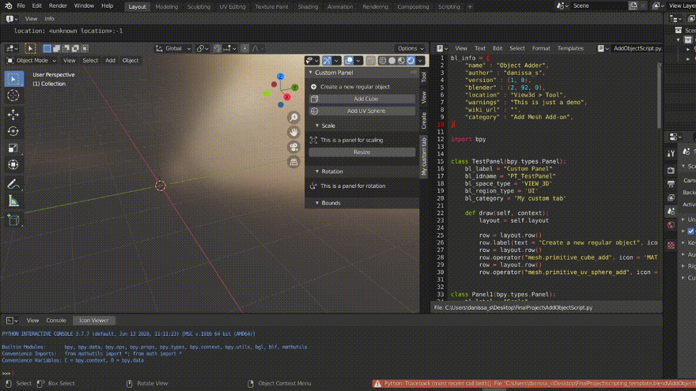

# Final Project
## Face Detection (progress result .gif)
Download https://github.com/italojs/facial-landmarks-recognition/blob/master/shape_predictor_68_face_landmarks.dat

To realize our project, we will need to detect face features in real time. For this, we are going to use OpenCV library, especially Dlib. This algorithm detects identifiable face features, like eyes, brows, nose, mouth, lips. It creates map of points, which highlight those features. To do this, Dlib has functions get_frontal_face_detector() and shape_predictor(), however predictor needs a pre-trained model, which we have downloaded from the internet, the link shown in the Github. The map could be used to assign controls to facial features. Since our project is focused on real time control, we need to use webcam too. OpenCV also has such function. We have made the gif of our output.

## Blender Python Scripting test (progress result .gif)
For our project, we are using Blender 2.92.0 Python API (**bpy**) which allows developers to incorporate Python scripts into Blender. Using this library's capabilities we are going to create an add-on that would use PC's camera in order to then detect facial landmarks and mark them on the 3D avatar created in Blender. To start out we got ourselves familiar with Python scripting in Blender. In particular, we created a testing custom panel (shown on the gif below) named "Custom Panel" under "My Custom tab". This panel is here just to test out some basic functionalities that are available in Blender's Python scripting, such as:
- Creating and laying out panels in add-ons
- Creation of the new object (creating a new cube and UV sphere mesh)
- Changing current object's properties (Euler's rotation, scaling along various axes, etc.)
- Changing viewport display options (displaying object bounds)
Those scripting properties would then be used to incorporate our facial detection algorithm into Blender and bound it with an existing avatar with a possible ability to tweak some properties of it.

Below is the test of the resulting demo add-on:

